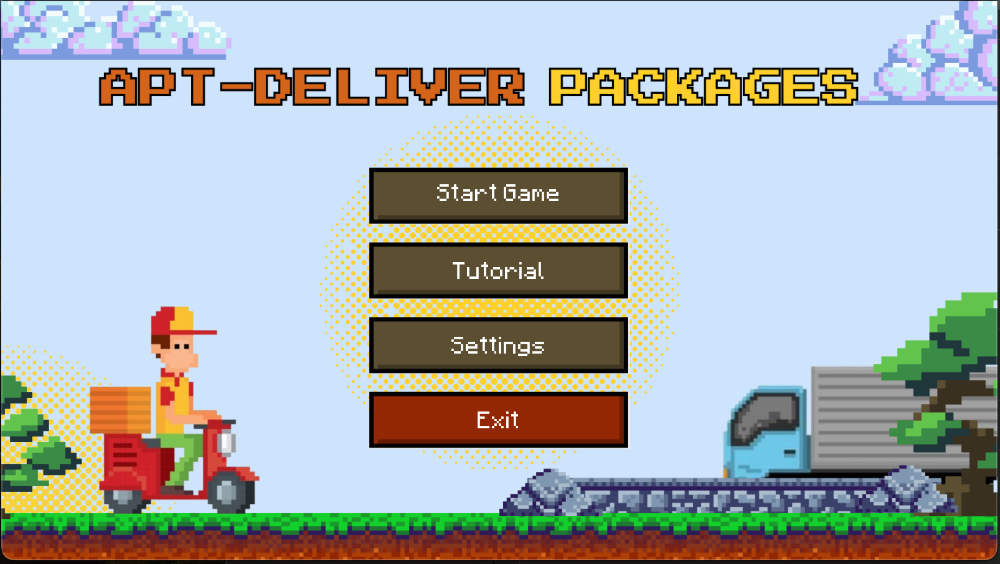
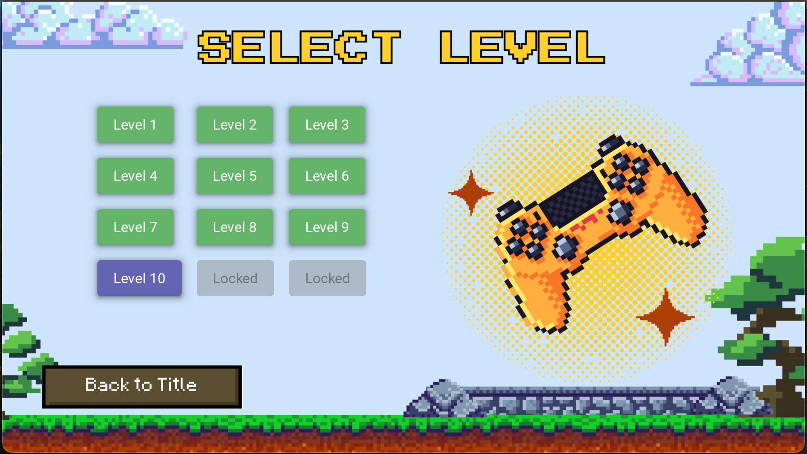
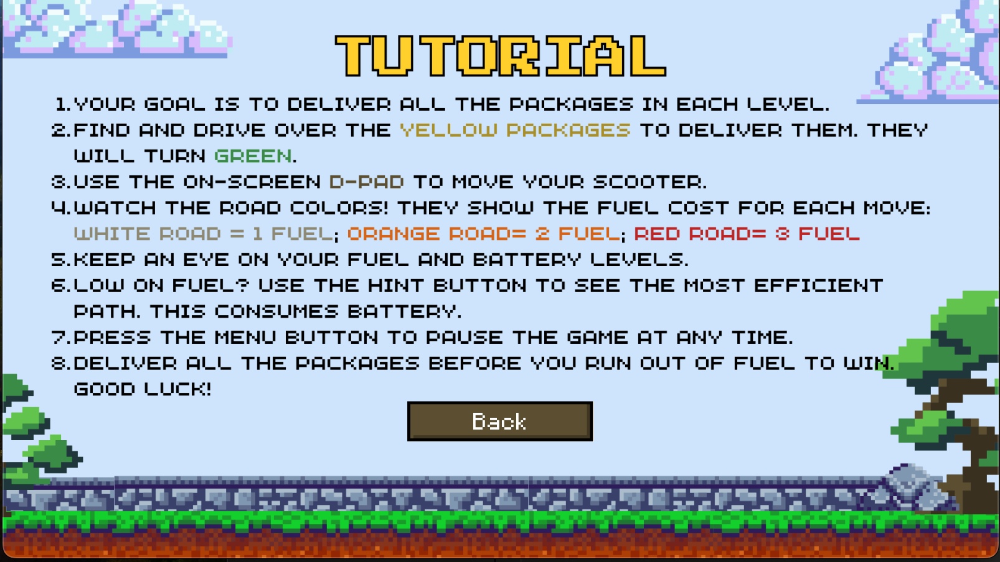
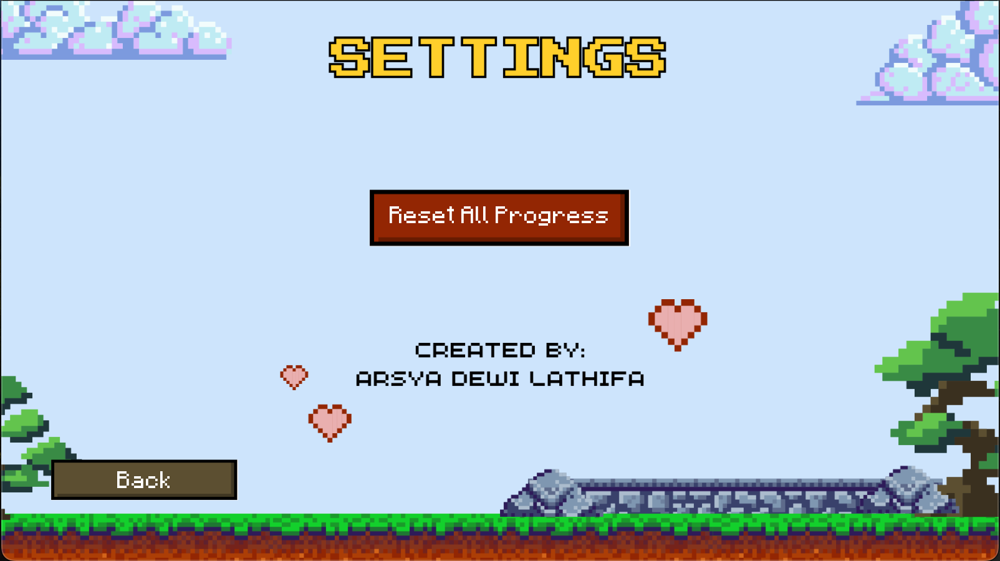
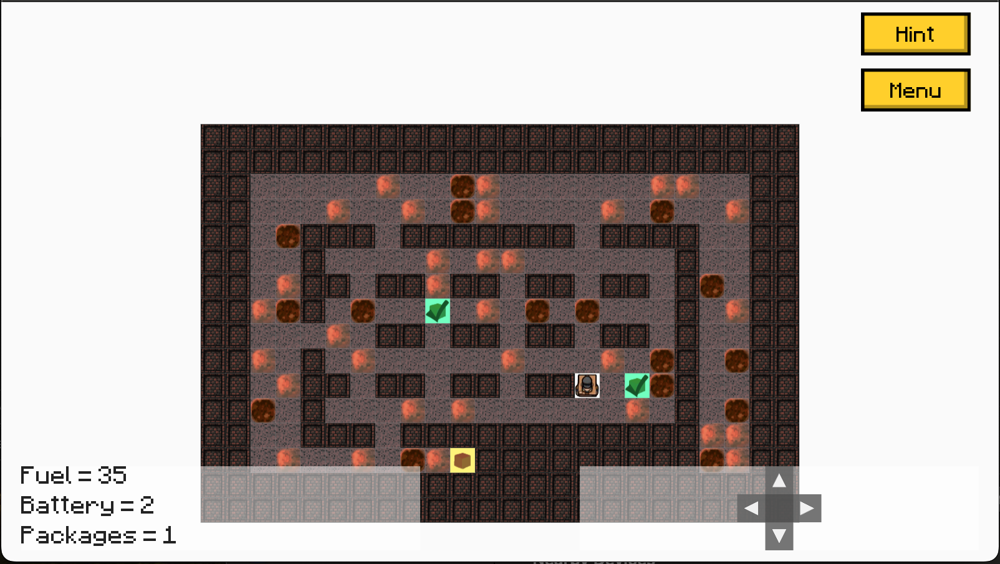
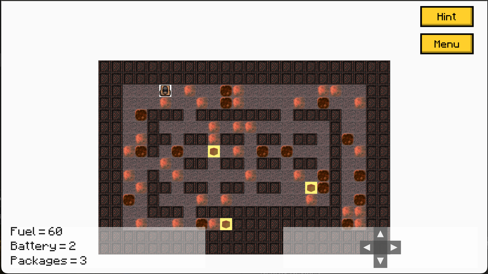
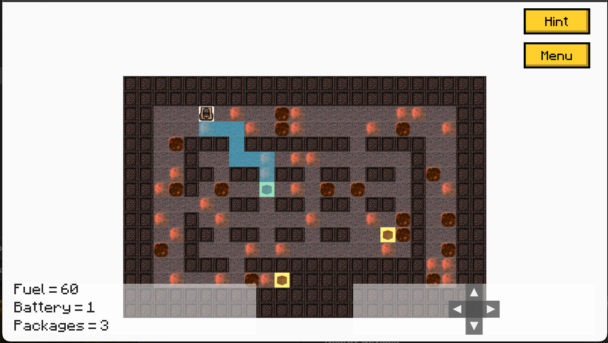

# ✨apt-deliver packages✨ (Android compatible version)

A pathfinding-based puzzle game where the player controls a delivery robot to deliver packages efficiently across a map using the A* algorithm.

## 📍 Features
- Grid-based delivery gameplay
- Pathfinding with A*
- Fuel limitation, obstacles
- Multiple levels with increasing complexity

## 📋 Algorithm Used
We use A* Algorithm to find the shortest path between delivery points. The map is represented as a matrix where nodes are tiles and edges represent possible moves.

## 🕹️ Gameplay
- Use arrow keys / wasd to move
- Plan routes carefully to avoid fuel loss
- Use your battery to get optimal paths
- Complete all deliveries before running out

## 📊 Game Play
|  |  |
| ----- | ----- |
|  |  |
|  |  |
| | |

[screenshots](https://drive.google.com/drive/folders/1sbBDQzeyarHMUTVr3DXRqNvMcYWIryTj?usp=drive_link)
